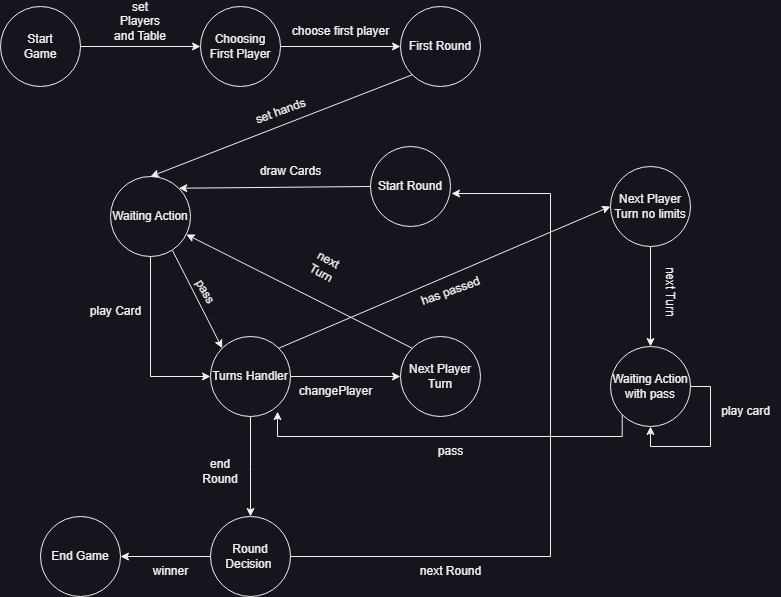

# Gwen't

This work is licensed under a
[Creative Commons Attribution 4.0 International License](http://creativecommons.org/licenses/by/4.0/)

Context
-------

This project's goal is to create a (simplified) clone of the
[_Gwent_](https://www.playgwent.com/en)card game developed by [_CD PROJEKT RED_](https://cdprojektred.com/en/)

---

# Tarea 2 
Hola, para esta entrega se han agregado las siguientes mejoras y funcionalidades:

* Se ha creado la clase PlayerTable y GeneralTable las cuales representan la tabla para un jugador
  y el tablero general que contiene los tableros para cada uno de los jugadores

* Se han arreglado algunos casos bordes como por ejemplo el caso en que las gemas fueran negativas

* Se han agregado un par de excepciones para manejar errores que podrían existir

# Observaciones:
- Se ha usado double dispatch para colocar las cartas en el tablero,
  de esta forma el programa resolvera de manera dinamica como colocarlas
  dependiendo de su tipo.

- El método "setCardOnTable" de la clase PlayerTable no considera exactamente que jugador está usándolo
  pues esto se delega al controlador cuando se aplique un sistema modelo vista controlador en el cual ahi 
  se manejara quien es el jugador que está poniendo la carta en su tabla, ya que antes de esto se debe 
  saber de quien es el turno de jugar y colocar cartas.

# Entrega Parcial 4:
Para esta entrega se han realizado el controlador para este juego, mediante el uso del patron de diseño 
State pattern, además se han testeado las transiciones y se dio un ejemplo que corrobora que se 
lanza el error correctamente cuando se intenta pasar a un estado que no corresponde.

Acá se adjunta el diagrama de estados que seguirá:

## Diagrama de estados

